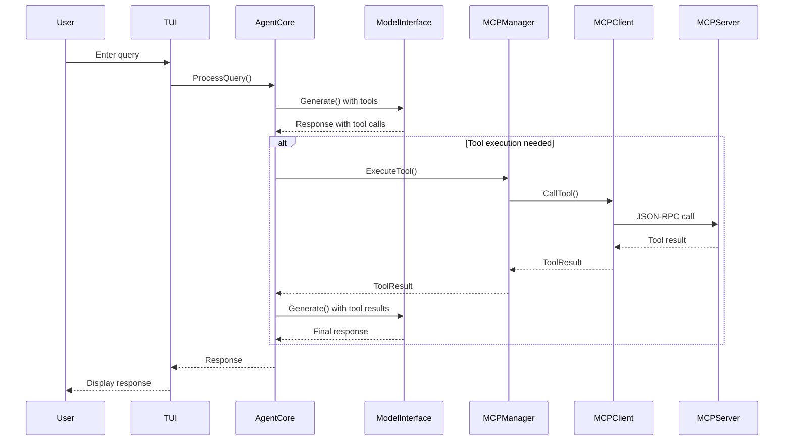
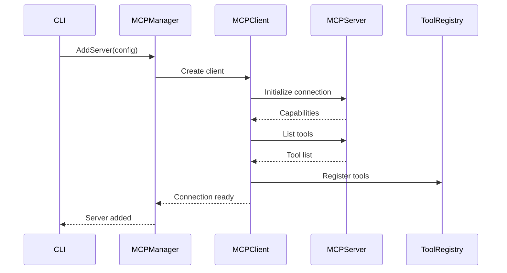
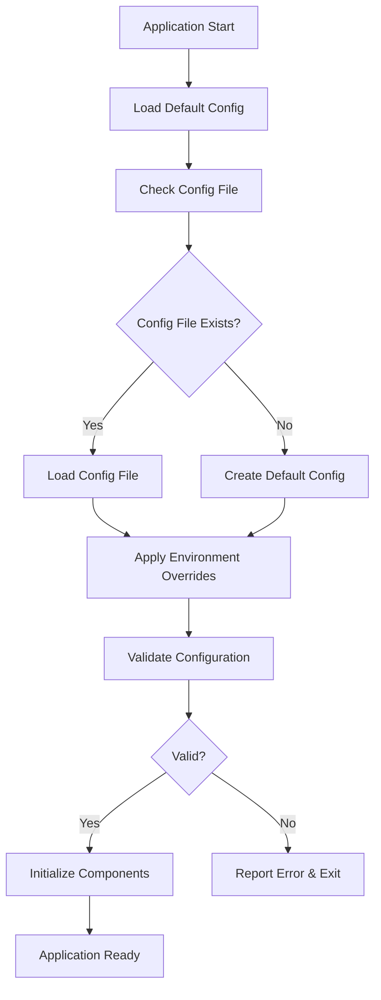

# Architecture Documentation
## Othello AI Agent

**Version:** 1.0  
**Date:** October 10, 2025  
**Document Type:** Technical Architecture  

---

## Table of Contents

1. [Overview](#overview)
2. [System Architecture](#system-architecture)
3. [Component Design](#component-design)
4. [Data Flow](#data-flow)
5. [Integration Patterns](#integration-patterns)
6. [Security Architecture](#security-architecture)
7. [Deployment Architecture](#deployment-architecture)
8. [Development Guidelines](#development-guidelines)

---

## Overview

### Architecture Philosophy

Othello follows a modular, layered architecture built on Go's principles of simplicity, performance, and reliability. The design emphasizes:

- **Separation of Concerns**: Clear boundaries between UI, business logic, and integrations
- **Dependency Injection**: Loose coupling through interfaces and dependency injection
- **Concurrent Design**: Leveraging Go's goroutines for parallel operations
- **Error Handling**: Explicit error handling throughout the system
- **Testability**: Design for comprehensive unit and integration testing

### Key Architectural Decisions

| Decision | Rationale | Trade-offs |
|----------|-----------|------------|
| Go Language | Performance, single binary deployment, excellent concurrency | Learning curve for non-Go developers |
| JSON-RPC over STDIO | MCP standard, simple implementation | Limited to local processes for STDIO |
| Bubbletea TUI | Modern, reactive UI framework | Terminal-only interface |
| Ollama Integration | Excellent local model management | Dependency on external tool |
| SQLite Storage | Embedded, reliable, no setup required | Single-node only |

---

## System Architecture

### High-Level Architecture

```
┌─────────────────────────────────────────────────────────────┐
│                    Othello Agent                           │
├─────────────────────────────────────────────────────────────┤
│  Presentation Layer                                         │
│  ├── TUI Application (bubbletea)                           │
│  ├── CLI Commands (cobra)                                  │
│  └── HTTP API (optional)                                   │
├─────────────────────────────────────────────────────────────┤
│  Application Layer                                          │
│  ├── Agent Core                                            │
│  ├── Conversation Manager                                  │
│  ├── Tool Execution Engine                                 │
│  └── Configuration Manager                                 │
├─────────────────────────────────────────────────────────────┤
│  Domain Layer                                               │
│  ├── MCP Client                                            │
│  ├── Model Interface                                       │
│  ├── Tool Registry                                         │
│  └── Server Registry                                       │
├─────────────────────────────────────────────────────────────┤
│  Infrastructure Layer                                       │
│  ├── Storage (SQLite)                                      │
│  ├── File System                                           │
│  ├── Network (HTTP/STDIO)                                  │
│  └── Process Management                                     │
└─────────────────────────────────────────────────────────────┘
```

### Deployment View

```
┌─────────────────────────────────────────────────────────────┐
│  Host Machine                                               │
│                                                             │
│  ┌─────────────────┐  ┌─────────────────┐                 │
│  │   Othello       │  │     Ollama      │                 │
│  │   Agent         │◄─┤   (Optional)    │                 │
│  │                 │  │                 │                 │
│  └─────────────────┘  └─────────────────┘                 │
│           │                                                │
│           ▼                                                │
│  ┌─────────────────┐  ┌─────────────────┐                 │
│  │  MCP Server 1   │  │  MCP Server N   │                 │
│  │  (filesystem)   │  │   (database)    │                 │
│  │                 │  │                 │                 │
│  └─────────────────┘  └─────────────────┘                 │
│                                                             │
│  ┌─────────────────────────────────────────────────────┐   │
│  │  Local Storage                                      │   │
│  │  ├── ~/.othello/config.yaml                        │   │
│  │  ├── ~/.othello/history.db                         │   │
│  │  └── ~/.othello/servers.json                       │   │
│  └─────────────────────────────────────────────────────┘   │
└─────────────────────────────────────────────────────────────┘
```

---

## Component Design

### Core Components

#### 1. Agent Core (`internal/agent/core.go`)

**Responsibility**: Central orchestrator managing the agent's lifecycle and coordinating between components.

```go
type AgentCore struct {
    config          *config.Config
    mcpManager      *mcp.Manager
    modelInterface  model.Interface
    toolRegistry    *registry.ToolRegistry
    conversationMgr *ConversationManager
    logger          *log.Logger
}

type Interface interface {
    Start(ctx context.Context) error
    Stop(ctx context.Context) error
    ProcessQuery(ctx context.Context, query string) (*Response, error)
    GetStatus() *Status
}
```

**Key Features**:
- Lifecycle management (start, stop, health checks)
- Query processing coordination
- Error handling and recovery
- Component initialization and dependency injection

#### 2. MCP Manager (`internal/mcp/manager.go`)

**Responsibility**: Manages connections to MCP servers and coordinates tool discovery.

```go
type Manager struct {
    clients    map[string]*Client
    registry   *ServerRegistry
    toolStore  *ToolStore
    transport  TransportFactory
    logger     *log.Logger
}

type Interface interface {
    AddServer(ctx context.Context, config ServerConfig) error
    RemoveServer(ctx context.Context, name string) error
    ListServers() []ServerInfo
    ExecuteTool(ctx context.Context, toolName string, params map[string]interface{}) (*ToolResult, error)
    DiscoverTools(ctx context.Context) error
}
```

**Key Features**:
- Multiple server connection management
- Tool discovery and caching
- Connection health monitoring
- Automatic reconnection handling

#### 3. MCP Client (`internal/mcp/client.go`)

**Responsibility**: Implements the MCP protocol for communication with individual servers.

```go
type Client struct {
    serverConfig ServerConfig
    transport    Transport
    capabilities Capabilities
    tools        []Tool
    connected    bool
    logger       *log.Logger
}

type Interface interface {
    Connect(ctx context.Context) error
    Disconnect(ctx context.Context) error
    ListTools(ctx context.Context) ([]Tool, error)
    CallTool(ctx context.Context, name string, params map[string]interface{}) (*ToolResult, error)
    HandleNotification(ctx context.Context, notification *Notification) error
}
```

**Key Features**:
- JSON-RPC 2.0 implementation
- Capability negotiation
- Real-time notification handling
- Error recovery and retry logic

#### 4. Model Interface (`internal/model/interface.go`)

**Responsibility**: Abstracts model interaction to support multiple backends.

```go
type Interface interface {
    Generate(ctx context.Context, request *GenerateRequest) (*GenerateResponse, error)
    GenerateStream(ctx context.Context, request *GenerateRequest) (<-chan *GenerateChunk, error)
    ListModels(ctx context.Context) ([]ModelInfo, error)
    LoadModel(ctx context.Context, modelName string) error
    GetCapabilities() *Capabilities
}

type GenerateRequest struct {
    Model       string                 `json:"model"`
    Messages    []Message              `json:"messages"`
    Tools       []Tool                 `json:"tools,omitempty"`
    Temperature float64                `json:"temperature,omitempty"`
    MaxTokens   int                   `json:"max_tokens,omitempty"`
    Stream      bool                  `json:"stream,omitempty"`
}
```

**Implementations**:
- **OllamaClient**: Primary implementation using Ollama HTTP API
- **GGUFClient**: Direct GGUF model loading
- **HTTPClient**: Generic HTTP API client

#### 5. TUI Application (`internal/tui/app.go`)

**Responsibility**: Manages the terminal user interface using bubbletea.

```go
type App struct {
    agentCore   agent.Interface
    state       AppState
    components  map[string]tea.Model
    keyMap      KeyMap
    styles      Styles
}

type Model interface {
    tea.Model
    Focus()
    Blur()
    SetSize(width, height int)
}
```

**Components**:
- **ChatView**: Main conversation interface
- **ServerView**: MCP server management
- **StatusView**: System status and logs
- **HelpView**: Context-sensitive help

### Data Models

#### Core Domain Types

```go
// MCP Protocol Types
type Tool struct {
    Name        string          `json:"name"`
    Description string          `json:"description"`
    InputSchema map[string]any  `json:"inputSchema"`
}

type ToolResult struct {
    Content []Content `json:"content"`
    IsError bool      `json:"isError,omitempty"`
}

type ServerConfig struct {
    Name      string            `json:"name"`
    Command   string            `json:"command"`
    Args      []string          `json:"args,omitempty"`
    Env       map[string]string `json:"env,omitempty"`
    Transport string            `json:"transport"` // "stdio" or "http"
}

// Conversation Types
type Message struct {
    Role      string    `json:"role"`      // "user", "assistant", "system"
    Content   string    `json:"content"`
    Timestamp time.Time `json:"timestamp"`
    ToolCalls []ToolCall `json:"tool_calls,omitempty"`
}

type Conversation struct {
    ID       string    `json:"id"`
    Messages []Message `json:"messages"`
    Created  time.Time `json:"created"`
    Updated  time.Time `json:"updated"`
}
```

---

## Data Flow

### Query Processing Flow



### MCP Server Connection Flow



### Configuration Loading Flow



---

## Integration Patterns

### MCP Integration Pattern

The agent implements the MCP client pattern with the following key aspects:

#### Transport Abstraction
```go
type Transport interface {
    Connect(ctx context.Context) error
    Disconnect(ctx context.Context) error
    Send(ctx context.Context, request *JSONRPCRequest) (*JSONRPCResponse, error)
    Subscribe(ctx context.Context) (<-chan *JSONRPCNotification, error)
}

// Implementations
type STDIOTransport struct {
    cmd    *exec.Cmd
    stdin  io.WriteCloser
    stdout io.ReadCloser
}

type HTTPTransport struct {
    baseURL string
    client  *http.Client
}
```

#### Protocol Implementation
```go
type ProtocolHandler struct {
    transport Transport
    requestID int64
    pending   map[int64]chan *JSONRPCResponse
    logger    *log.Logger
}

func (p *ProtocolHandler) Initialize(ctx context.Context, params InitializeParams) (*InitializeResult, error) {
    request := &JSONRPCRequest{
        ID:     p.nextID(),
        Method: "initialize",
        Params: params,
    }
    
    response, err := p.transport.Send(ctx, request)
    if err != nil {
        return nil, fmt.Errorf("initialize failed: %w", err)
    }
    
    var result InitializeResult
    if err := json.Unmarshal(response.Result, &result); err != nil {
        return nil, fmt.Errorf("unmarshal initialize result: %w", err)
    }
    
    return &result, nil
}
```

### Model Integration Pattern

The agent uses a pluggable model interface to support multiple backends:

```go
type ModelFactory interface {
    CreateModel(config ModelConfig) (Interface, error)
    SupportedTypes() []string
}

var modelFactories = map[string]ModelFactory{
    "ollama": &OllamaFactory{},
    "gguf":   &GGUFFactory{},
    "http":   &HTTPFactory{},
}

func NewModel(config ModelConfig) (Interface, error) {
    factory, exists := modelFactories[config.Type]
    if !exists {
        return nil, fmt.Errorf("unsupported model type: %s", config.Type)
    }
    
    return factory.CreateModel(config)
}
```

### Event-Driven Architecture

The system uses Go channels for event communication:

```go
type EventBus struct {
    subscribers map[EventType][]chan<- Event
    mutex       sync.RWMutex
}

type Event struct {
    Type      EventType   `json:"type"`
    Source    string      `json:"source"`
    Data      interface{} `json:"data"`
    Timestamp time.Time   `json:"timestamp"`
}

// Event types
const (
    MCPServerConnected    EventType = "mcp.server.connected"
    MCPServerDisconnected EventType = "mcp.server.disconnected"
    ToolDiscovered        EventType = "tool.discovered"
    ToolExecuted          EventType = "tool.executed"
    ModelResponseStart    EventType = "model.response.start"
    ModelResponseEnd      EventType = "model.response.end"
)
```

---

## Security Architecture

### Process Isolation

```
┌─────────────────────────────────────────────────────────────┐
│  Othello Agent Process                                      │
│  ├── Limited privileges                                     │
│  ├── No network access (except localhost)                  │
│  └── Controlled file system access                         │
│                                                             │
│  ┌─────────────────┐  ┌─────────────────┐                 │
│  │  MCP Server 1   │  │  MCP Server 2   │                 │
│  │  (separate      │  │  (separate      │                 │
│  │   process)      │  │   process)      │                 │
│  └─────────────────┘  └─────────────────┘                 │
└─────────────────────────────────────────────────────────────┘
```

### Data Protection

```go
type SecureConfig struct {
    encryptionKey []byte
    salt         []byte
}

func (s *SecureConfig) EncryptSensitive(data []byte) ([]byte, error) {
    // Encrypt sensitive configuration data
    cipher, err := aes.NewCipher(s.encryptionKey)
    if err != nil {
        return nil, err
    }
    
    gcm, err := cipher.NewGCM()
    if err != nil {
        return nil, err
    }
    
    nonce := make([]byte, gcm.NonceSize())
    if _, err := io.ReadFull(rand.Reader, nonce); err != nil {
        return nil, err
    }
    
    return gcm.Seal(nonce, nonce, data, nil), nil
}
```

### Input Validation

```go
type Validator struct {
    schemas map[string]*jsonschema.Schema
}

func (v *Validator) ValidateToolInput(toolName string, input map[string]interface{}) error {
    schema, exists := v.schemas[toolName]
    if !exists {
        return fmt.Errorf("no schema found for tool: %s", toolName)
    }
    
    if err := schema.Validate(input); err != nil {
        return fmt.Errorf("tool input validation failed: %w", err)
    }
    
    return nil
}
```

---

## Deployment Architecture

### Binary Distribution

```
othello-{version}-{os}-{arch}/
├── othello                    # Main binary
├── README.md                  # Quick start guide
├── LICENSE                    # License file
├── configs/
│   └── default.yaml          # Default configuration
└── examples/
    ├── servers/               # Example MCP server configs
    └── workflows/             # Example workflows
```

### Configuration Hierarchy

```
1. Compiled defaults (lowest priority)
2. System-wide config (/etc/othello/config.yaml)
3. User config (~/.othello/config.yaml)
4. Local config (./othello.yaml)
5. Environment variables
6. Command line flags (highest priority)
```

### Directory Structure

```go
type Directories struct {
    Config    string // ~/.othello/
    Data      string // ~/.othello/
    Cache     string // ~/.othello/cache/
    Runtime   string // ~/.othello/runtime/
}

func GetDirectories() (*Directories, error) {
    dataDir, err := os.UserHomeDir()
    if err != nil {
        return nil, err
    }
    
    othelloDir := filepath.Join(dataDir, ".othello")
    
    return &Directories{
        Config:  othelloDir,
        Data:    othelloDir,
        Cache:   filepath.Join(othelloDir, "cache"),
        Runtime: filepath.Join(othelloDir, "runtime"),
    }, nil
}
```

---

## Development Guidelines

### Code Organization

```
internal/
├── agent/           # Core agent logic
│   ├── core.go      # Main orchestrator
│   ├── conversation.go
│   └── executor.go
├── mcp/             # MCP client implementation
│   ├── client.go    # Individual MCP client
│   ├── manager.go   # Client manager
│   ├── transport/   # Transport implementations
│   └── protocol/    # Protocol handlers
├── model/           # Model abstraction
│   ├── interface.go # Model interface
│   ├── ollama/      # Ollama implementation
│   └── gguf/        # GGUF implementation
├── tui/             # Terminal UI
│   ├── app.go       # Main TUI app
│   ├── components/  # UI components
│   └── styles/      # Styling
├── config/          # Configuration
├── storage/         # Data persistence
└── types/           # Shared types
```

### Error Handling

```go
// Custom error types
type MCPError struct {
    Code    int    `json:"code"`
    Message string `json:"message"`
    Data    any    `json:"data,omitempty"`
}

func (e MCPError) Error() string {
    return fmt.Sprintf("MCP error %d: %s", e.Code, e.Message)
}

// Error wrapping pattern
func (c *Client) CallTool(ctx context.Context, name string, params map[string]interface{}) (*ToolResult, error) {
    if err := c.validateConnection(); err != nil {
        return nil, fmt.Errorf("call tool %s: %w", name, err)
    }
    
    result, err := c.sendToolCall(ctx, name, params)
    if err != nil {
        return nil, fmt.Errorf("call tool %s: %w", name, err)
    }
    
    return result, nil
}
```

### Testing Strategy

```go
// Interface-based testing
type MockModelInterface struct {
    responses map[string]*GenerateResponse
}

func (m *MockModelInterface) Generate(ctx context.Context, req *GenerateRequest) (*GenerateResponse, error) {
    response, exists := m.responses[req.Model]
    if !exists {
        return nil, fmt.Errorf("no mock response for model: %s", req.Model)
    }
    return response, nil
}

// Integration testing
func TestMCPIntegration(t *testing.T) {
    server := startTestMCPServer(t)
    defer server.Stop()
    
    client := mcp.NewClient(mcp.Config{
        Command: server.Command(),
    })
    
    err := client.Connect(context.Background())
    require.NoError(t, err)
    
    tools, err := client.ListTools(context.Background())
    require.NoError(t, err)
    assert.NotEmpty(t, tools)
}
```

### Performance Considerations

```go
// Connection pooling
type ConnectionPool struct {
    clients map[string]*Client
    mutex   sync.RWMutex
    maxSize int
}

// Caching
type ToolCache struct {
    tools map[string]*Tool
    ttl   time.Duration
    mutex sync.RWMutex
}

// Resource limits
type ResourceLimits struct {
    MaxConnections     int           `yaml:"max_connections"`
    ConnectionTimeout  time.Duration `yaml:"connection_timeout"`
    RequestTimeout     time.Duration `yaml:"request_timeout"`
    MaxMemoryUsage     int64         `yaml:"max_memory_usage"`
}
```

### Logging and Observability

```go
// Structured logging
type Logger struct {
    *slog.Logger
    component string
}

func (l *Logger) WithContext(ctx context.Context) *slog.Logger {
    return l.Logger.With(
        "trace_id", getTraceID(ctx),
        "component", l.component,
    )
}

// Metrics collection
type Metrics struct {
    ToolExecutions prometheus.Counter
    ResponseTime   prometheus.Histogram
    ActiveSessions prometheus.Gauge
}
```

This architecture provides a solid foundation for building a scalable, maintainable AI agent while adhering to Go best practices and supporting the complex requirements of MCP integration.